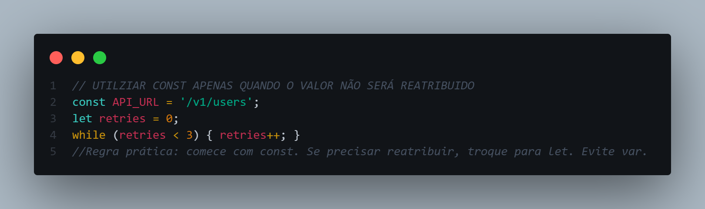
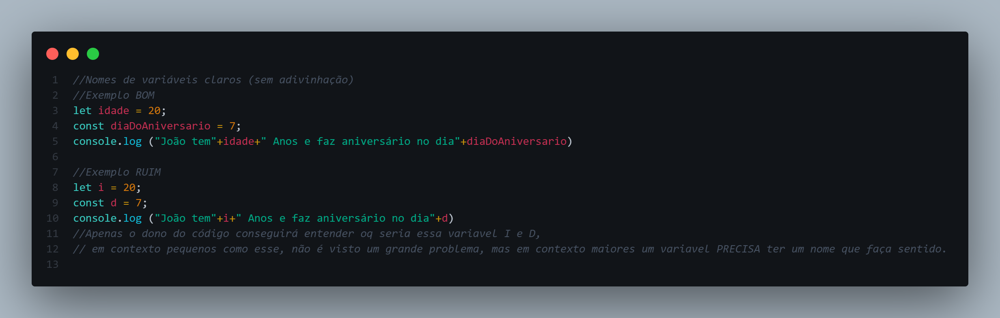

<h1 align="center"> JORNADA JAVASCRIPT   </h1>
<div align="center" display="flex">
<p>
  
  <strong>"Oi, eu sou o João!"</strong> 
</p> 
</div>


<h2>O que é Jornada JavaScript?</h2>
<p>
  Jornada JavaScript nada mais é que uma forma pensada por mim para que eu possa aprender essa linguagem, mas também uma forma de ajudar outras pessoas que estão na mesma posição em que eu estou, um estudante de tecnologia que quer evoluir nesse seguimento.
</p>
<br>
<br>
<br>
<div>
<h2 align="center">Boas práticas</h2>
<p align="center"></p>
<h3>Quando usar const e let?</h3>
<ul>
  <li>Use const por padrão. Indica intenção de não reatribuir a referência. Isso ajuda o motor e quem lê o código.</li>
  <li>Use let apenas quando a variável será reatribuída (contador de loop, acumuladores, flags).</li>
</ul>
  
<h3>Nomes de variáveis claros (sem adivinhação)</h3>
  <ul>
    <li>Os nomes devem fazer sentido com o contexto</li>
    <li>Booleanos como perguntas (valido , aErro)</li>
    <li>Evite abreviações internas (a não ser padrões amplos como id, url)</li>
  </ul>
  
</div>

<br>
<h2 align="center">Sintaxe básica</h2>

<h3>Caracteres:</h3>
  <ul>
    <li>O JavaScript utiliza o conjunto de caracteres <b>Unicode</b>;</li>
    <li>É uma linguagem <b>case-sensitive</b>, ou seja, diferencia caracteres maiúsculos e minúsculos.</li>
  </ul>

<h3>Comentários:</h3>
  <p>
    No JavaScript, comentários podem ser adicionados ao longo do código das seguintes maneiras:
  </p>

```javascript
// - Para comentários em uma única linha de código

/* - Para comentários em múltiplas linhas */
```

<h3>Hello, World!</h3>
  <p>
    Ao aprender uma nova linguagem de programação, o "Hello, World!", ou "Olá, Mundo!" é um primeiro passo extremamente importante!<br><br>
    O "Hello, World!" se refere a um programa que possui a simples função de exibir uma mensagem para o usuário, e pode ser feito no JavaScript de algumas formas, como por exemplo:
  </p>

  ```javascript
console.log("Hello, World!")

alert("Hello, World!")
```

<h2 align="center">Declarações</h2>
  <h3>Tipos de declarações</h3>
    <p>
      Existem três tipos de declarações no JavaScript, sendo elas:
    </p>
    <ul>
      <li><b>var</b>: Forma tradicional de se declarar uma variável, mas não recomendada nos dias atuais por questões de otimização;</li>
      <li><b>let</b>: Forma mais utilizada para a declaração de uma variável nos dias de hoje;</li>
      <li><b>const</b>: Declara uma constante, ou seja, seu valor não pode ser alterado após a primeira atribuição.</li>
    </ul>

```javascript
// - Exemplos de declarações utilizando os três tipos:

var exemplo_var=0;
let exemplo_let="Exemplo";
const EXEMPLO_CONST=true 
```

  

